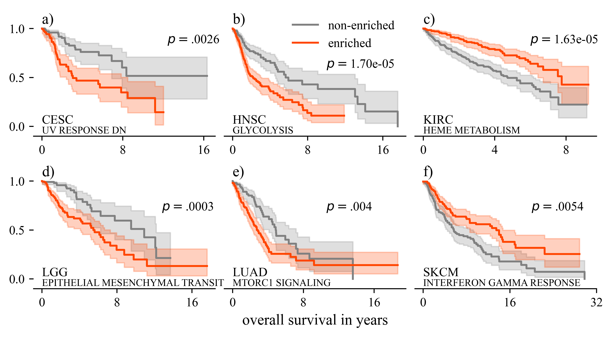
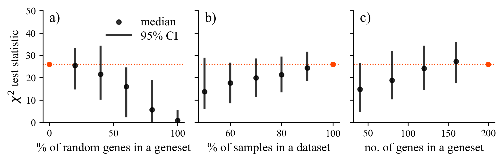
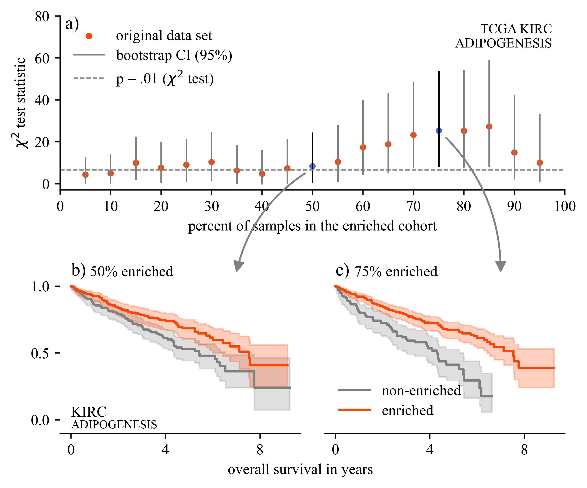

[](https://doi.org/10.5281/zenodo.7572950)


# AIME-2023: Ranking of Cancer Survival-Related Gene Sets through Integration of Single-Sample Gene Set Enrichment and Survival Analysis


The scripts and data used to perform the analysis and generate the figures are available in this repository.

## Instalation

The code was tested on Ubuntu 20.04.4 LTS and MacOS 13.1. With python versions 3.9.15 and 3.10.8.

Follow these steps to prepare the environment:

- Clone the repository

```bash
git clone https://github.com/biolab/AIME-2023-paper.git
cd AIME-2023-paper
```

- Install the required packages

```bash
# using pip in a virtual environment
pip install -r requirements.txt

# using Conda
conda create --name <env_name> --file requirements.txt
conda activate <env_name>
```

---

## Generating the data:

1. Run **download_data.py**. You will have to download a 1.4 Gb file manually. Instructions will be printed when you run a scipt.

2. Run **parse_datasets.py**. Make sure you have enough RAM (at least 8 GB)

3. Run **calculate_ssGSEA_scores.py**. This will calculate ssGSEA for each sample-geneset pair in all TCGA datasets.

4. Run **calculate_logrank_test.py**. This will calculate logrank tests and store the results.

## Generating plots

First, generate all the data before attempting to plot.

In the folder **notebooks/** there are notebooks that reproduce all the code necessary to plot figures 1 to 3. Figures are stored in the **figures/** folder.

# [Figure 1: Kaplan-Meier survival curves for the best-performing gene set.](notebooks/1.0-figure1.ipynb)



</br>
</br>

# [Figure 2: Testing the robustness of the method](notebooks/2.0-figure2.ipynb)



</br>
</br>

# [Figure 3: Comparison of Km plots for 50% and 75% enriched](notebooks/3.0-figure3.ipynb)



---
