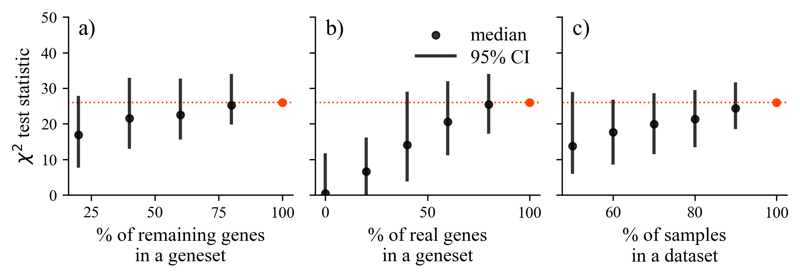

# AIME-2023: Ranking of Cancer Survival-Related Gene Sets through Integration of Single-Sample Gene Set Enrichment and Survival Analysis

The code for reproducing the article: Ranking of Cancer Survival-Related Gene Sets through Integration of Single-Sample Gene Set Enrichment and Survival Analysis

---

## Instalation

```
conda env create -f requirements.txt

conda activate genesetranking
```

---

## Generating the data

1. Run **download_data.py**. You will have to download a 1.4 Gb file manually. Instructions will be printed when you run a scipt.

2. Run **parse_datasets.py**. Make sure you have enough RAM (at least 8 GB, 5GB free)

3. Run **calculate_ssGSEA_scores.py**. This will calculate ssGSEA for each sample-geneset pair in all TCGA datasets.

4. Run **calculate_logrank_test.py**. This will calculate logrank tests and store the results.

## Generating plots

First, generate all the data before attempting to plot.

In the folder **notebooks/** there are notebooks that reproduce all the code necessary to plot figures 1 to 3. Figures are stored in the **figures/** folder.

- [Generate figure 1](notebooks/1.0-figure1.ipynb)


- [Generate figure 2](notebooks/2.0-figure2.ipynb)



- [Generate figure 3](notebooks/3.0-figure3.ipynb)


---
